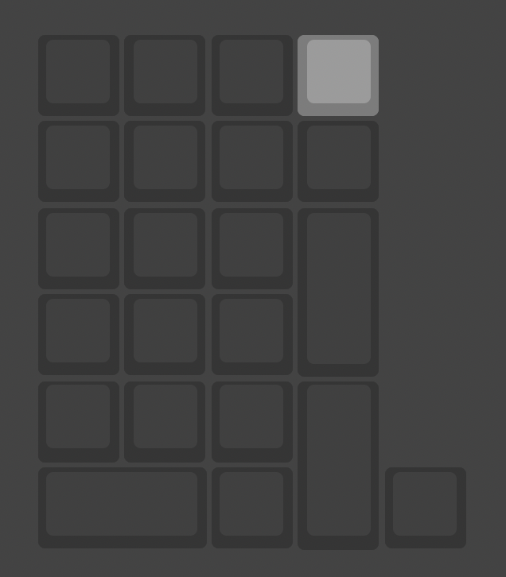
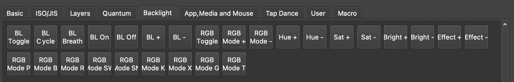
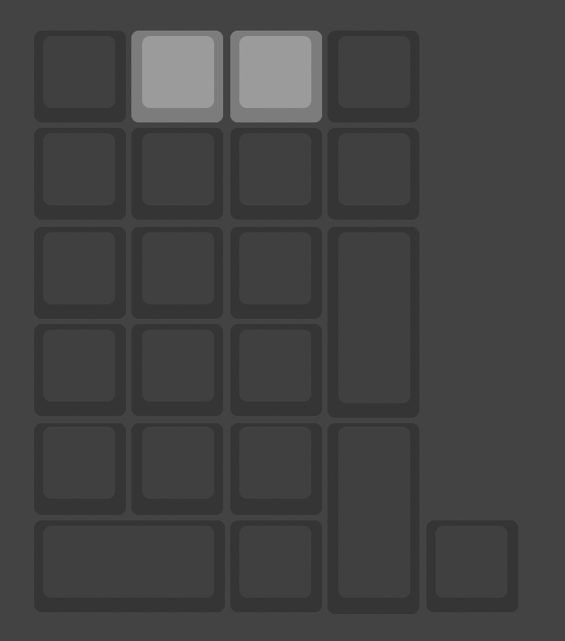
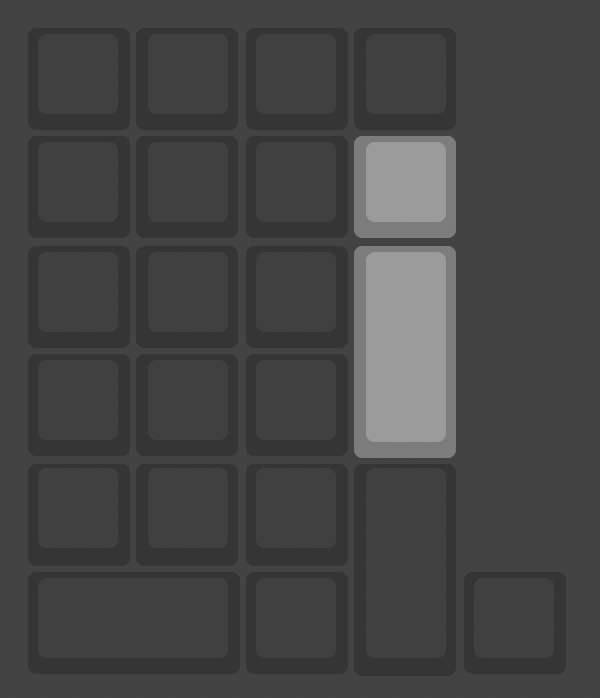

# バックライト

この章ではバックライトを設定する方法を説明します。

:::tip
事前に共通の準備が必要です。手順は [こちら](/docs/usb/config)
:::

:::note
ここでの説明は頒布時のキーマップ (キー割り当て) である前提です。すでにキーマップを変更している場合は、該当するキーを再度割り当てるか、一度リセットする必要があります。
:::

## オン・オフ

バックライトのオン・オフを切り替えるには、サイドスイッチを奥側にしたあと一番右上のキーを押します。

キーの割り当てとしては `Backlight` -> `RGB Toggle` が該当します。

## 発光モードの変更

発光モードを切り替えるには、サイドスイッチを奥側にしたあと最上部中央 2 個のキーを押します。左を押すと前のモードに、右を押すと次のモードに変化します。

キーの割り当てとしては `Backlight` -> `RGB Mode -` / `RGB Mode +` が該当します。

## 明るさの変更

明るさを切り替えるには、サイドスイッチを奥側にしたあとテンキーでいうところの `-`、 `+` キーを押します。

キーの割り当てとしては `Backlight` -> `Bright -` / `Bright +` が該当します。

