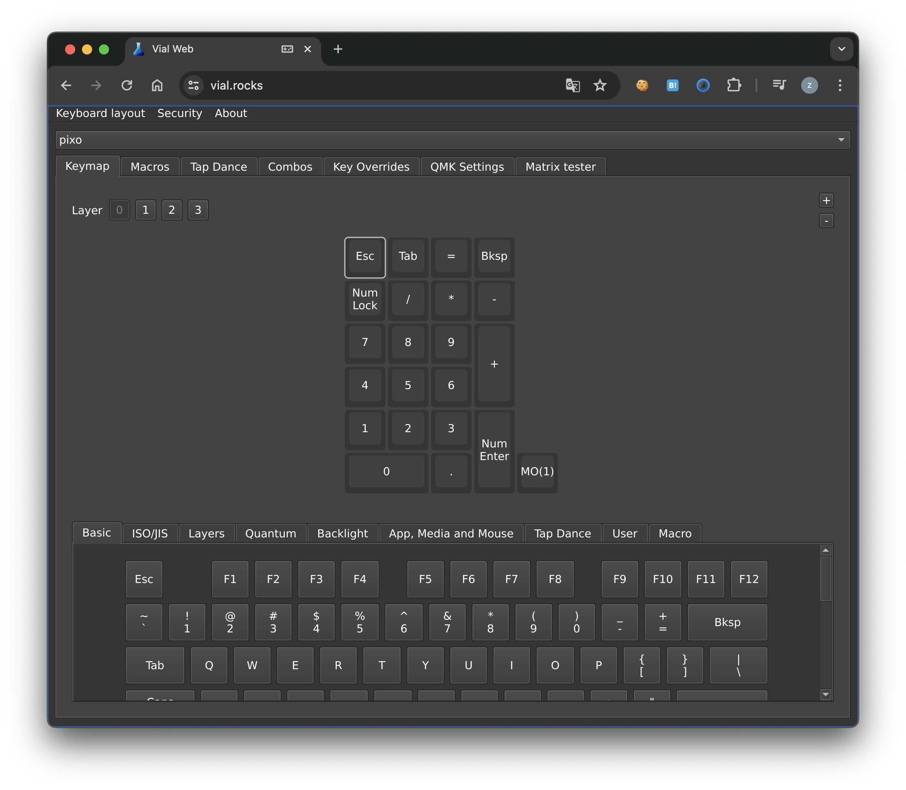
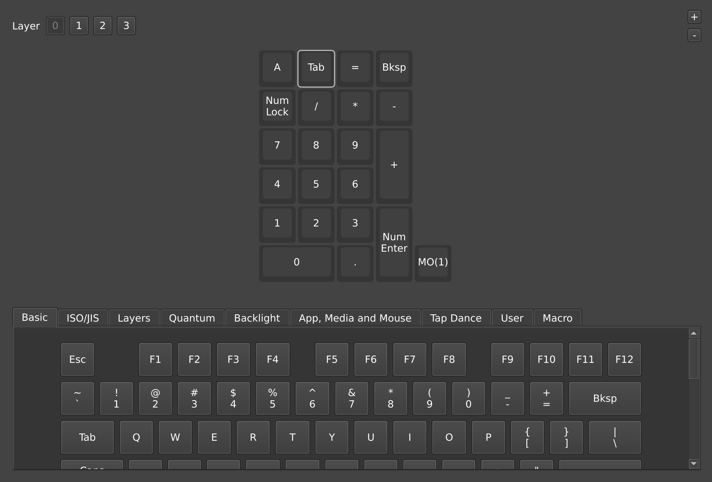
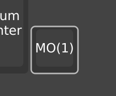
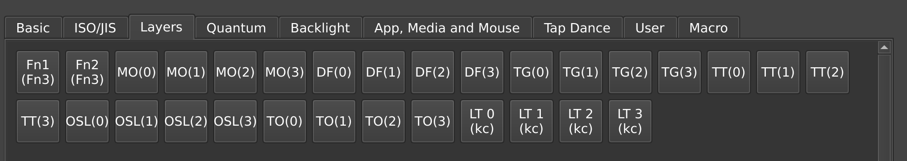

# キーマップ

この章ではキーの割り当てを変更する方法を説明します。

:::tip
事前に共通の準備が必要です。手順は [こちら](/docs/usb/config)
:::

`Keymap` タブを開き、操作を割り当てたいキーをクリックします。

画面下のキー一覧の中から割り当てたいキーをクリックすると割り当てることができます。

:::tip
左上の　`Layer` で割り当てるレイヤーを変えることができます。

頒布時点ではサイドスイッチによってレイヤー 0 とレイヤー 1 が切り替わるようになっているので、レイヤー 1 の割り当てを変えることでサイドスイッチ切り替え後のキーマップも変更することができます。
:::

:::tip
サイドスイッチ自体もキーとして認識されており、 `MO(1)` というのがサイドスイッチに該当します。

`MO(1)` は **押している間レイヤーを切り替える** という動作で、 `MO(1)` は **押している間レイヤーを 1 に切り替える** という動作になります。この動作は `Layers` タブから割り当てることができます。

:::

