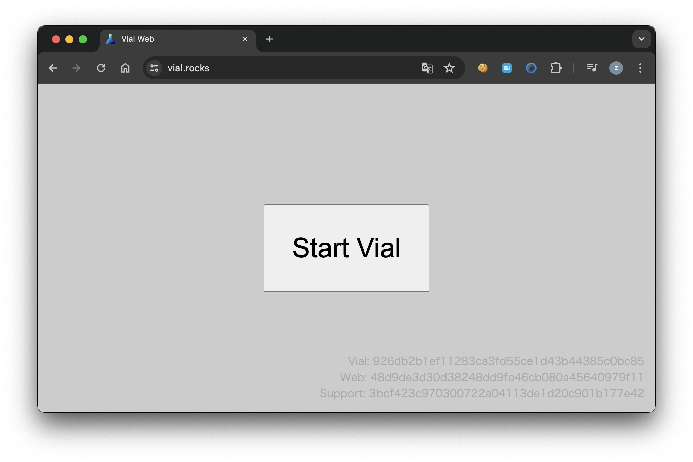
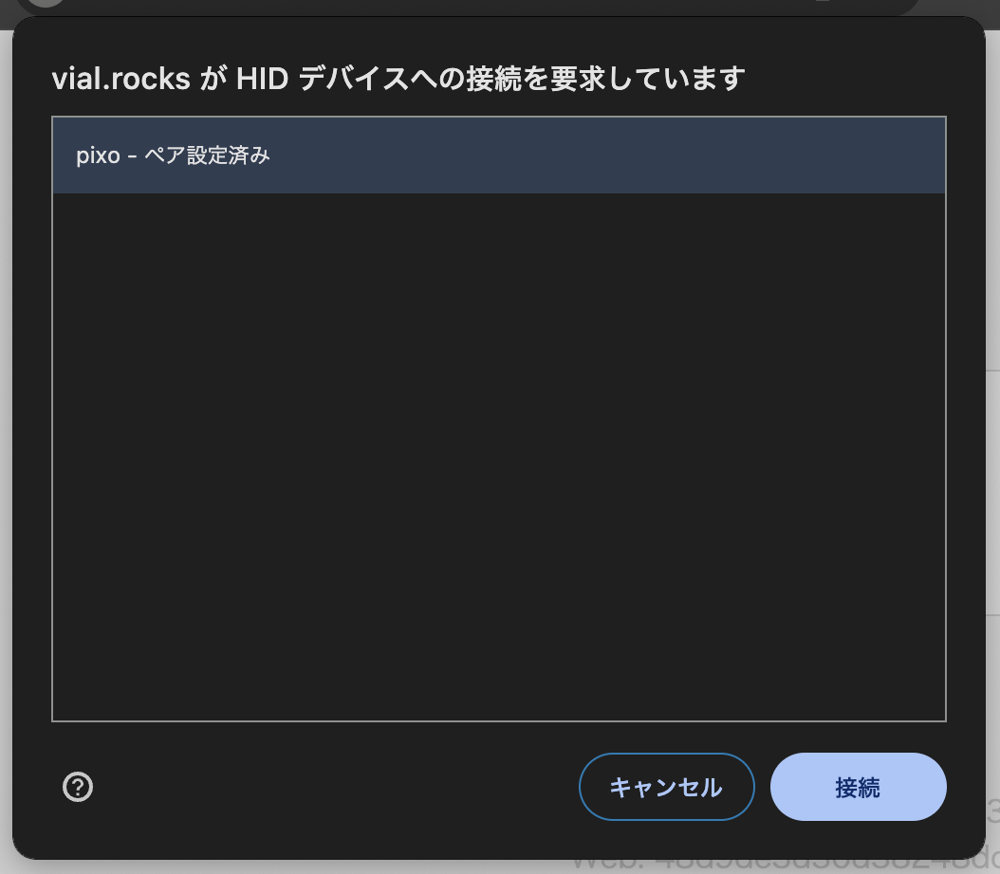
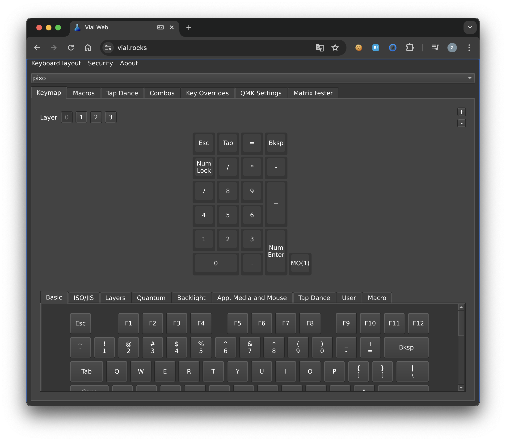
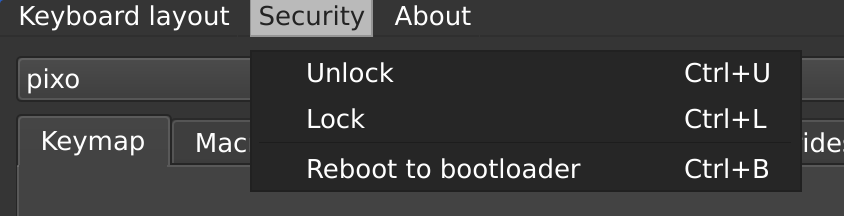
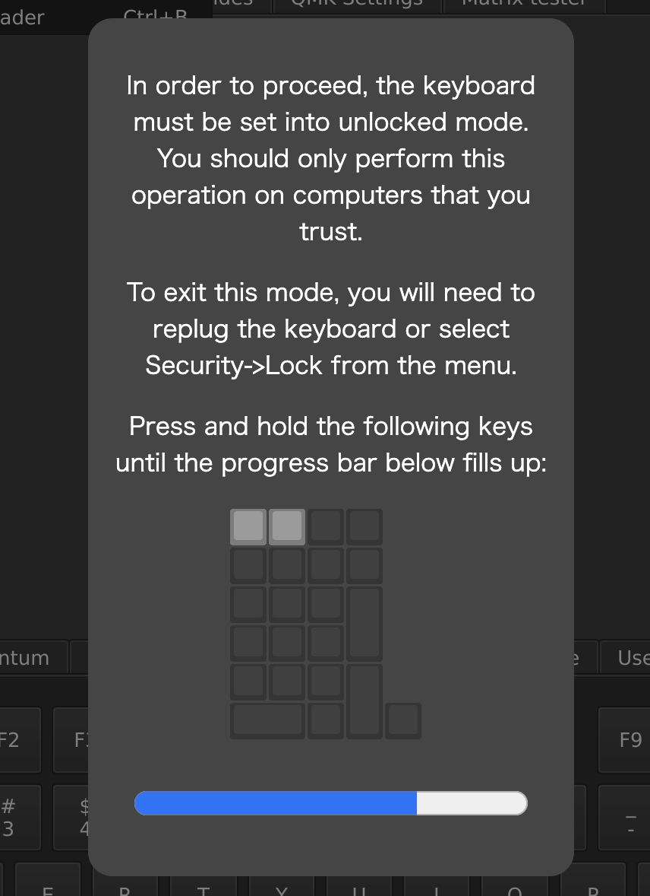
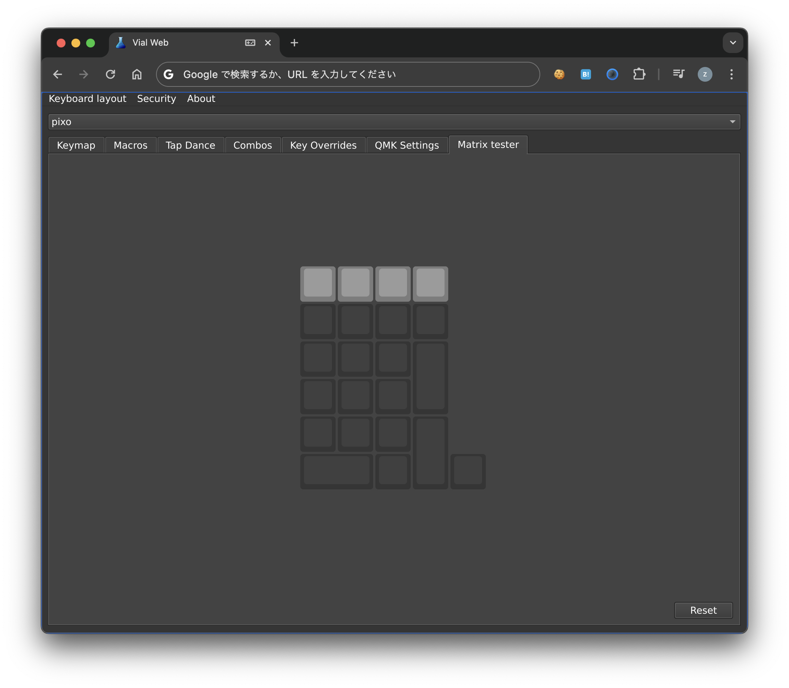

# 設定項目

設定項目ごとのページです

## 事前準備

キーボードの設定を変更するには以下のものが必要です。

- 本体
- USB 2.0 で通信できるケーブル
- Windows, macOS または Linux のインストールされた PC

本体を Windows, macOS, Linux など [Google Chrome](https://www.google.com/chrome/) が動作する PC に接続します。

:::note
Android / iOS からのキーマップ変更には対応していません。ただしキーマップの設定情報はキーボード本体に保存されるので
一度 PC に接続して設定を変更すれば Android / iOS でもカスタマイズした設定を利用することができます。
:::

### Google Chrome のインストール

[Google Chrome](https://www.google.com/chrome/) をインストールします。

### `Vial` の起動

[`Vial`](https://get.vial.today/) はキーボードをリアルタイムに設定できるオープンソースのツールです。

**Google Chrome で** [Vial](https://vial.rocks/) を開きます。

:::note
必ず **Google Chrome** で開いてください。 Vial ではハードウェアに設定を行うために [WebHID](https://developer.mozilla.org/ja/docs/Web/API/WebHID_API) という技術を利用していますが、この技術を利用できるブラウザは今のところ [Google Chrome だけ](https://caniuse.com/webhid) だからです。
:::

PC と本体が接続できていることを確認し、 `Start Vial` ボタンをクリックします。

デバイス選択画面が開くので、 `pixo` を選択して `接続` ボタンをクリックします。

メイン画面が開きます。

### デバイスのアンロック

セキュリティ上キーボードの設定が変更できないようになっているので、ロックを解除します。

:::note
USB 接続を解除すると再度ロックされます
:::

左上メニューの `Security` をクリックし、 `Unlock` をクリックします。

本体の一番左上とその右のキーを画面上のバーがいっぱいになるまで推し続けます。

`Matrix Tester` タブを開き、キーを押すと正しく認識されているかを確認します。

ここまで完了したら、次は設定する内容ごとの記事通り操作してください。
