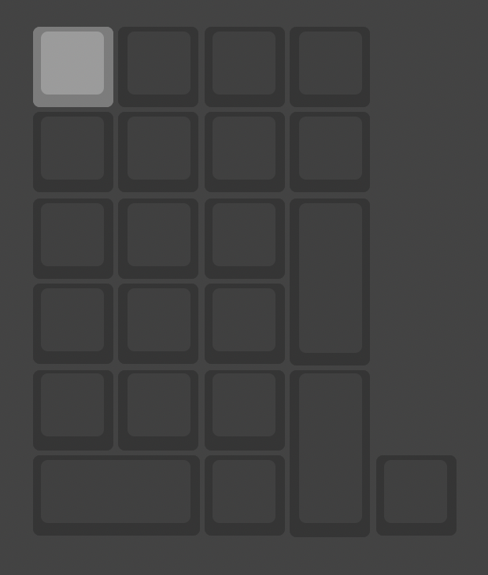
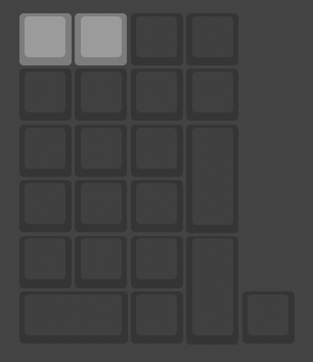

# BLE モデル

BLE モデルに関する情報について

モデルの判別方法は [こちら](/docs/intro)

## 基本的な使い方

### 有線接続

:::tip
キーマップの割り当て変更などを行う場合は有線接続する必要があります。
:::

:::note
給電 (充電) 専用など通信に対応していないケーブルは接続しても動作しません。必ず USB 2.0 で通信できるケーブルを利用してください。
:::

まず、 **サイドスイッチ (下) を下側にスライドします。**

:::note
電源投入時にサイドスイッチが上下どちらにあるかで無線・有線の切り替えを行っているため、 **有線接続する場合は事前にサイドスイッチ (下) を下にしておく必要があります。**
:::

本体の USB Type-C 接続端子に **USB 2.0 での通信に対応した USB Type-C ケーブル** を接続し、接続したいデバイスの USB 端子にケーブルを接続します。

数秒待ち、接続したデバイスに USB キーボードとして認識されれば OK です。

### 無線接続

:::tip
無線で動作するためには 3.7V の PH コネクタを採用したリチウムイオンポリマーバッテリーが必要です。
開発時には `DTP652533(PHR)` で動作確認しています。

- マルツ: https://www.marutsu.co.jp/pc/i/2582904/
:::

:::tip
無線接続時には消費電力を抑えるため、 RGB バックライトは動作しません。
:::

まず、 **サイドスイッチ (下) を上側にスライドします。**

:::note
電源投入時にサイドスイッチが上下どちらにあるかで無線・有線の切り替えを行っているため、 **無線接続する場合は事前にサイドスイッチ (下) を上にしておく必要があります。**
:::

電源供給用の USB Type-C ケーブルを接続するか、充電された 3.7V バッテリーを接続して **サイドスイッチ (上) を下側にスライド** します。

:::tip
バッテリー電源用サイドスイッチは下がオン、上がオフです。
:::

数秒経ったら **サイドスイッチ (下) を一度下に戻し、再度上にし、一番左上のキーを押します。

接続したいデバイスで Bluetooth デバイス一覧を開き、 `pixo` という名前のデバイスに接続します

:::tip
デバイスによってはデバイス名が取得できず、単に `Bluetooth デバイス` と表示される場合があります。
:::

:::tip
左上のキーを押してもデバイスが見つけられない場合、一つ右のキーも同時に押してみてください。
押したあとは手を離してください。

:::

